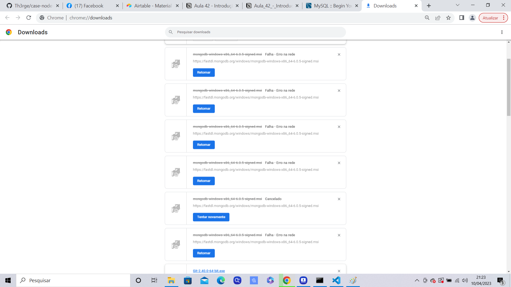

# case-node-dev

## Instruções de uso local

- Faça o download do projeto
```
 git clone [link github]

```

- Vá até a pasta do arquivo que se encontra o arquivo package.json e digite
```
 npm install

```


## URL DO PROJETO

[Link Github](https://github.com/Th3rge)

## Tecnologias, Frameworks e Bibliotecas

**Typescript**: typescript por ser tipada e excelente para o back-end, além de ser compatível com express, knex e mysql
**Express**: Express para crir a conexão da API
**MySQL**: O case pedia o MongoDB, mas travei muito na parte do MongoDB, pois o site oficial estava com defeito para baixa-lo, então para ter um DB optei pelo MySQL
**NodeJS**: Manuseio de pacotes para o projeto 

